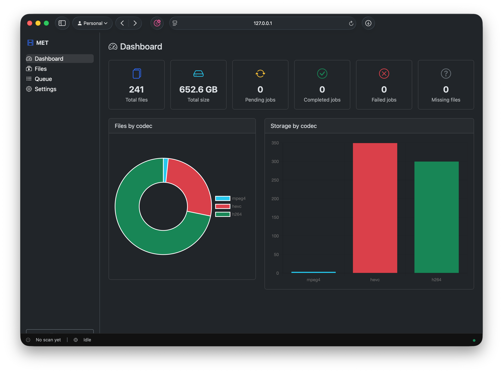
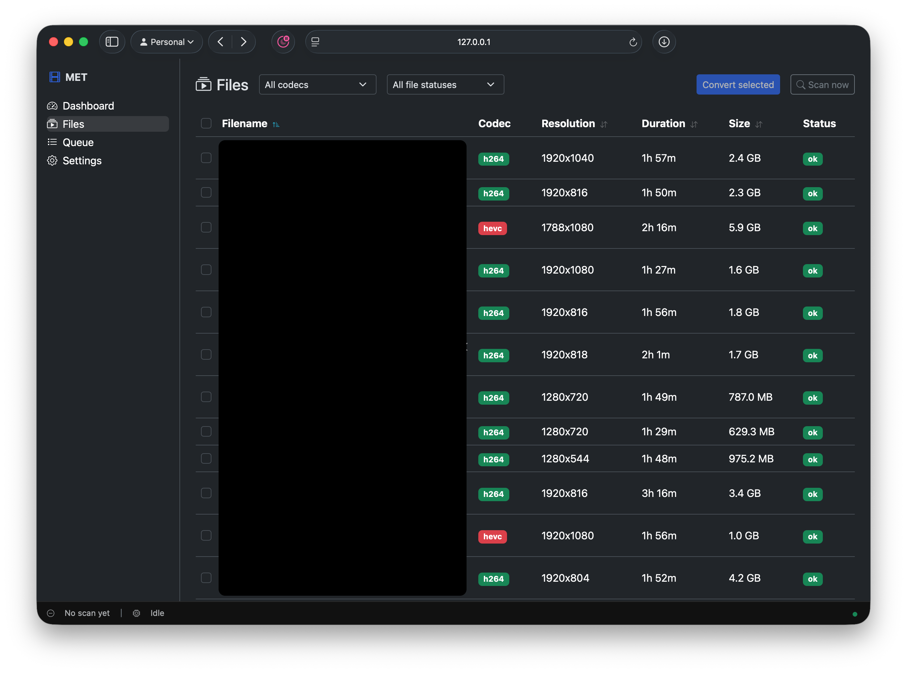
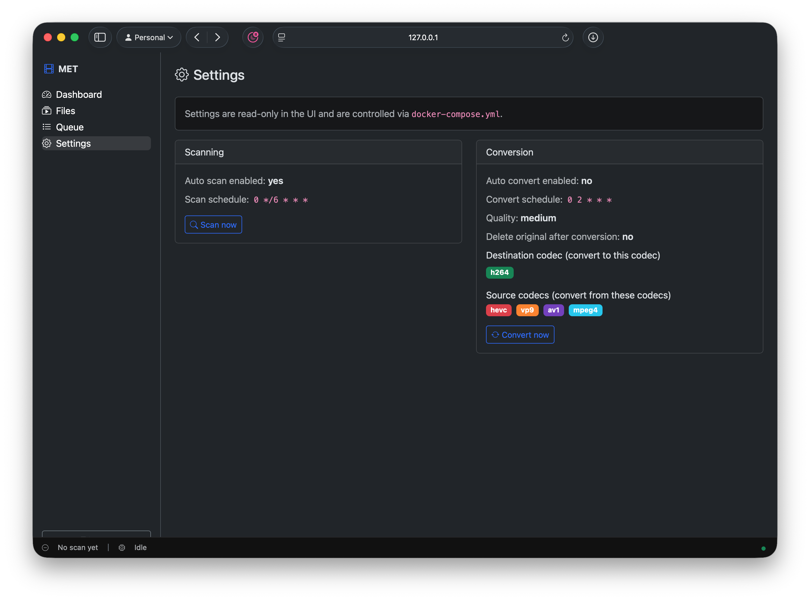

# Media Encoding Tracker

A containerised Python web app for tracking, scheduling and batch-converting
media files in a directory — built for the Raspberry Pi 4B.

Made pretty much entirely by GPT-5.3-Codex in the background while I was doing other things. All I wanted was a simple tool to keep track of my HEVC-encoded media library and be able to convert to H.264 for better compatibility with my ancient Apple TV so that's what it delivered.

## Features

| Feature                     | Detail                                                                             |
| --------------------------- | ---------------------------------------------------------------------------------- |
| **Directory scanning**      | Discovers video files via `ffprobe`; stores codec, resolution, duration, file size |
| **Web UI**                  | Bootstrap 5 single-page app: Dashboard, Files, Queue, Settings                     |
| **Individual conversion**   | Select any file(s) from the Files page → add to queue                              |
| **Batch / auto conversion** | Schedule a cron job that converts files matching configured source codecs          |
| **Conversion quality**      | CRF-based: Low (28), Medium (23), High (18), Very High (15)                        |
| **Delete original**         | Optionally remove the source file after a successful encode                        |
| **Progress tracking**       | ffmpeg stderr is parsed; progress (0–100 %) is polled live in the UI               |
| **Queue log viewer**        | Click any queue row to inspect captured ffmpeg stderr logs (live while running)    |
| **Stats page**              | File counts and storage by codec; job status breakdown; Chart.js charts            |
| **Scheduled scan**          | Cron-based directory scan to pick up newly added media                             |
| **Auth**                    | HTTP Basic Auth; credentials set via environment variable                          |
| **Docker**                  | Single image with ffmpeg; tested on ARM64 (RPi4b)                                  |

## Screenshots (yay)







---

## Quick start

### 1. Clone and configure

```bash
git clone https://github.com/ntflix/media-encoding-tracker
cd media-encoding-tracker
cp .env.example .env   # edit ADMIN_PASS and MEDIA_ROOT
```

### 2. Edit `docker-compose.yml`

Change the media volume mount to match your SMB share:

```yaml
volumes:
  - /mnt/your-share:/media:rw # ← left side = host path
```

### 3. Run

```bash
docker compose up -d
```

Open **http://\<rpi-ip\>:8000** in a browser, sign in with `ADMIN_USER` /
`ADMIN_PASS`, and click **Settings → Scan now** to discover your library.

---

## Configuration reference

All settings are environment variables (or `.env` file entries):

| Variable     | Default            | Description                                                |
| ------------ | ------------------ | ---------------------------------------------------------- |
| `MEDIA_ROOT` | `/media`           | Path inside the container where the media share is mounted |
| `DB_PATH`    | `/data/tracker.db` | SQLite database path                                       |
| `ADMIN_USER` | `admin`            | Web UI username                                            |
| `ADMIN_PASS` | `changeme`         | Web UI password — **change this!**                         |
| `HOST`       | `0.0.0.0`          | Bind address                                               |
| `PORT`       | `8000`             | Listen port                                                |
| `LOG_LEVEL`  | `info`             | Python log level                                           |

Compose-controlled runtime settings (shown read-only in the Settings page):

| Variable                        | Default                   | Description                                                |
| ------------------------------- | ------------------------- | ---------------------------------------------------------- |
| `AUTO_SCAN_ENABLED`             | `true`                    | Enable scheduled scans                                     |
| `SCAN_SCHEDULE`                 | `0 */6 * * *`             | Cron expression for automatic directory scans              |
| `AUTO_CONVERT_ENABLED`          | `false`                   | Enable scheduled auto-convert enqueueing                   |
| `CONVERT_SCHEDULE`              | `0 2 * * *`               | Cron for auto-conversion                                   |
| `DEFAULT_QUALITY`               | `medium`                  | Quality profile used for queued conversions                |
| `DELETE_ORIGINAL_AFTER_CONVERT` | `false`                   | Delete source file after successful conversion             |
| `DESTINATION_CODEC`             | `h264`                    | Destination codec to convert to                            |
| `SOURCE_CODECS`                 | `hevc,vp9,av1,mpeg4`      | Source codecs to convert from                              |
| `FFMPEG_BIN`                    | `ffmpeg`                  | ffmpeg executable path inside the container                |
| `COMPOSE_FILE_PATH`             | `/app/docker-compose.yml` | Compose file path used by one-time setup validation screen |

If you want to run a host-provided ffmpeg binary, bind-mount it and set `FFMPEG_BIN` to the in-container path:

```yaml
volumes:
  - /opt/homebrew/bin:/host-bin:ro
environment:
  FFMPEG_BIN: /host-bin/ffmpeg
```

---

## Conversion details

- **Output format:** Determined by `DESTINATION_CODEC` (for example `h264`, `hevc`, `av1`, `vp9`).
- **Output file naming:** `{original_stem}.{destination_codec}.{container_ext}` in the same directory as the source.
- **If delete_original is on:** the source file is deleted and the converted file keeps the `.h264.mp4` name.
- **Concurrency:** one job at a time (appropriate for RPi4b's quad-core CPU).
- **ffmpeg preset:** `slow` for software encode paths. If V4L2 H.264 devices are available in the container, H.264 conversion uses `h264_v4l2m2m` with bitrate mode.

### CRF cheat sheet

| Quality level | CRF | Notes                                                             |
| ------------- | --- | ----------------------------------------------------------------- |
| Low           | 28  | ~40 % smaller than source, visible quality loss on complex scenes |
| Medium        | 23  | ffmpeg default, good balance (recommended)                        |
| High          | 18  | Near-transparent, larger files                                    |
| Very High     | 15  | Almost lossless, very large files                                 |

---

## Hardware acceleration on RPi4b

The Raspberry Pi 4B's VideoCore VI GPU exposes a V4L2 M2M H.264 encoder
(`/dev/video10–12`) on Raspberry Pi OS. Inside Docker this requires passing the devices through in `docker-compose.yml`:

```yaml
devices:
  - /dev/video10:/dev/video10
  - /dev/video11:/dev/video11
  - /dev/video12:/dev/video12
```

No code changes are then required. The app detects these devices automatically and, for `DESTINATION_CODEC=h264`, switches to:

```python
"-c:v", "h264_v4l2m2m",
"-b:v", "4M",   # V4L2 is VBR, no CRF
```

> **Note:** V4L2 quality control differs from CRF-based libx264 and the
> driver may not be available in all kernel/OS combinations. Software
> encoding with `libx264` is the default for reliability.

---

## Development

### Install

```bash
python -m venv .venv && source .venv/bin/activate
pip install -e ".[dev]"
cp .env.example .env  # set MEDIA_ROOT to a local dir with test videos
```

### Run locally

```bash
uvicorn app.main:app --reload
```

### Run tests

```bash
pytest -v
```

### Type-check (strict pyright)

```bash
pyright
```

### Lint

```bash
ruff check . && ruff format --check .
```

---

## Project layout

```
app/
  config.py      – Pydantic Settings (env vars)
  models.py      – SQLAlchemy ORM models + domain enums
  schemas.py     – Pydantic request/response schemas
  database.py    – Async SQLAlchemy engine setup
  auth.py        – HTTP Basic Auth dependency
  scanner.py     – ffprobe-based file scanner
  converter.py   – ffmpeg wrapper with async progress
  worker.py      – Background conversion queue (one job at a time)
  services.py    – Shared scan / auto-convert logic
  scheduler.py   – APScheduler cron job management
  main.py        – FastAPI app + lifespan
  routes/
    files.py     – File listing, individual scan trigger
    jobs.py      – Job creation, cancellation, deletion
    stats.py     – Statistics endpoint
    settings.py  – Compose-driven settings + setup check + manual triggers
  static/
    index.html   – SPA shell
    app.js       – Vanilla JS UI

tests/
  conftest.py    – Shared fixtures (in-memory DB, test client)
  test_scanner.py
  test_api.py
```

---

## API reference

Interactive docs are available at **http://\<host\>:8000/api/docs** (Swagger UI)
or **/api/redoc** (ReDoc) once the app is running.

Key endpoints:

| Method | Path                        | Description                                                           |
| ------ | --------------------------- | --------------------------------------------------------------------- |
| `GET`  | `/api/stats`                | Codec breakdown + job counts                                          |
| `GET`  | `/api/files`                | Paginated file list (`?codec=hevc&page=1&per_page=50`)                |
| `POST` | `/api/files/scan`           | Trigger an immediate scan                                             |
| `POST` | `/api/jobs`                 | Create conversion jobs (`{media_file_ids, quality, delete_original}`) |
| `POST` | `/api/jobs/{id}/cancel`     | Cancel a pending/running job                                          |
| `GET`  | `/api/settings`             | Read current settings                                                 |
| `POST` | `/api/settings/scan-now`    | Trigger scan + return summary                                         |
| `POST` | `/api/settings/convert-now` | Enqueue all matching files                                            |
| `GET`  | `/api/settings/setup-check` | Validate required compose env keys for one-time setup screen          |
